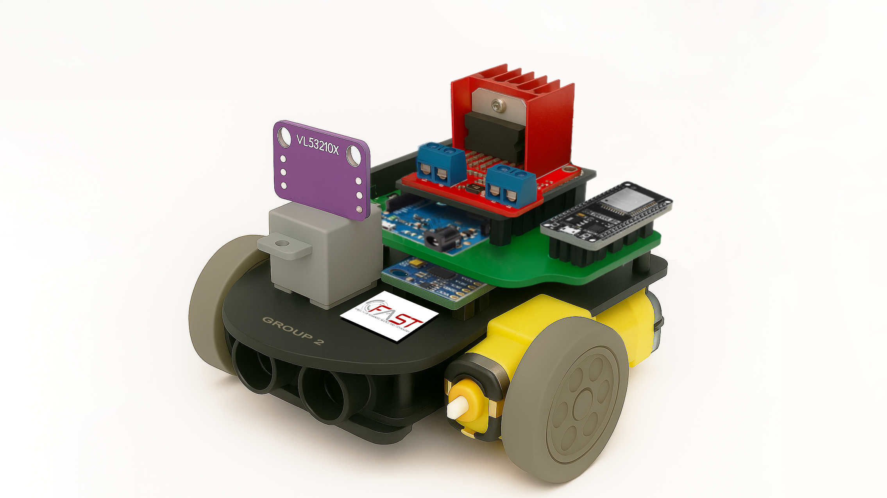

# 2D Mapping Autonomous Vehicle (2DMAV)

## Project Idea

In the era of **Industry 4.0**, mobile robotics and autonomous vehicles have become one of the most essential research areas.  
These systems can **navigate, avoid obstacles, localize, and build maps (SLAM)** — all of which are foundational technologies for self-driving cars, logistics robots, and drones.

The **Mobile Path-Finding Robot** project aims to develop a **small-scale autonomous vehicle** capable of:
- Moving autonomously and avoiding obstacles.  
- Collecting environmental data through multiple sensors.  
- Transmitting data to a computer for **2D mapping and analysis**.  
- Serving as a research platform for **navigation, localization, and intelligent control algorithms**.

---

## Objectives

1. Enable the robot to **move and navigate** autonomously.  
2. **Detect and avoid obstacles** using ultrasonic and laser distance sensors.  
3. **Measure motion parameters** using encoder and IMU sensors.  
4. **Transmit real-time sensor data** to a computer via Wi-Fi or UART.  
5. **Process and reconstruct a 2D environment map** from collected data.  

---

## System Block Diagram

**Main functional blocks:**
- **Sensor Block** Collects environmental data from sensors.
- **Signal Processing & Control Block** Processes sensor signals and makes control decisions.
- **Display Data (Laptop)** Visualizes processed data for mapping and positioning.
- **Transmission Block** Sends control commands to the vehicle for movement.
---

## Motion Control Block Diagram

**Functions:**
- Read wheel rotation and speed from the **encoder**.  
- Receive obstacle information from **ultrasonic and laser sensors**.  
- Process sensor data and make navigation decisions (turn, stop, move forward).  
- Control **DC motors and servo motor** through the **L298N motor driver**.  

---

## Environmental Data Acquisition and Preprocessing Block Diagram

**Functions:**
- Acquire data from **ultrasonic, laser, IMU, and encoder** sensors.  
- Filter and calibrate signals (median and moving average filters).  
- Transmit processed data to the **computer** via Wi-Fi or UART.  
- On the PC, perform:
  - **2D environment mapping.**  
  - **Localization** of the robot based on encoder and IMU data.
---

