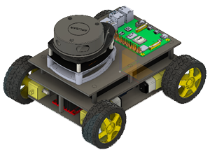

# 2D Mapping Autonomous Vehicle (2DMAV)

## 💡 Project Idea

In the era of **Industry 4.0**, mobile robotics and autonomous vehicles have become one of the most essential research areas.  
These systems can **navigate, avoid obstacles, localize, and build maps (SLAM)** — all of which are foundational technologies for self-driving cars, logistics robots, and drones.

The **Mobile Path-Finding Robot** project aims to develop a **small-scale autonomous vehicle** capable of:
- Moving autonomously and avoiding obstacles.  
- Collecting environmental data through multiple sensors.  
- Transmitting data to a computer for **2D mapping and analysis**.  
- Serving as a research platform for **navigation, localization, and intelligent control algorithms**.

---

## 🎯 Objectives

1. Enable the robot to **move and navigate** autonomously.  
2. **Detect and avoid obstacles** using ultrasonic and laser distance sensors.  
3. **Measure motion parameters** using encoder and IMU sensors.  
4. **Transmit real-time sensor data** to a computer via Wi-Fi or UART.  
5. **Process and reconstruct a 2D environment map** from collected data.  

---

## ⚙️ System Block Diagram

**Main functional blocks:**
- **Sensor Block:** Collects environmental data such as distance, direction, and motion.  
- **Control Unit:** Processes sensor data and executes navigation and obstacle avoidance algorithms.  
- **Actuation Block:** Includes DC motors, servo motor, and driver (L298N).  
- **Communication Block:** Transfers data to the PC for visualization and mapping.  
- **Processing Block:** Performs SLAM or 2D mapping and displays results in real-time.  

---

## 🚗 Motion Control Block Diagram

**Functions:**
- Read wheel rotation and speed from the **encoder**.  
- Receive obstacle information from **ultrasonic and laser sensors**.  
- Process sensor data and make navigation decisions (turn, stop, move forward).  
- Control **DC motors and servo motor** through the **L298N motor driver**.  

---

## 🌍 Environmental Data Acquisition and Preprocessing Block Diagram

**Functions:**
- Acquire data from **ultrasonic, laser, IMU, and encoder** sensors.  
- Filter and calibrate signals (median and moving average filters).  
- Transmit processed data to the **computer** via Wi-Fi or UART.  
- On the PC, perform:
  - **2D environment mapping.**  
  - **Localization** of the robot based on encoder and IMU data.  

---

## 🔧 Sensor Details

### 1. **Ultrasonic Sensor – HC-SR04**

| Parameter | Specification |
|------------|----------------|
| Measurement range | 2 – 400 cm |
| Resolution | 0.3 cm |
| Accuracy | ±3 mm |
| Effective angle | ±15° |
| Frequency | 40 kHz |
| Supply voltage | 5V DC |
| Response time | < 50 ms |
| Interface | Trigger / Echo |

**Principle:**  
Emits ultrasonic waves and measures the echo return time to calculate distance:  
\[
D(cm) = \frac{t_{echo}(\mu s)}{58}
\]

**Application:** Short-range obstacle detection and avoidance.

---

### 2. **Laser Distance Sensor – VL53L0X (ToF)**

| Parameter | Specification |
|------------|----------------|
| Technology | Time-of-Flight (ToF) |
| Measurement range | 30 mm – 2000 mm |
| Resolution | 1 mm |
| Accuracy | ±3% |
| Response time | 20–33 ms |
| Interface | I²C (Address 0x29) |
| Supply voltage | 2.6 – 3.5V |
| Field of View (FoV) | ±25° |
| Module size | 4.4 × 2.4 × 1.0 mm |

**Principle:**  
Measures the photon flight time to determine the distance:  
\[
D = \frac{c \times t_{TOF}}{2}
\]

**Application:** Precise distance sensing and 2D mapping.

---

### 3. **IMU Sensor – MPU-6050 (GY-521)**

| Parameter | Specification |
|------------|----------------|
| Axes | 3-axis accelerometer + 3-axis gyroscope |
| ADC Resolution | 16-bit |
| Acceleration range | ±2g / ±4g / ±8g / ±16g |
| Gyroscope range | ±250 / ±500 / ±1000 / ±2000 °/s |
| Sampling rate | 1 Hz – 1 kHz |
| Supply voltage | 3–5V |
| Communication | I²C |
| Operating temperature | –40°C to +105°C |

**Function:**  
Combines accelerometer and gyroscope data to determine the robot’s orientation (Pitch, Roll, Yaw).  
Includes an internal **Digital Motion Processor (DMP)** for sensor fusion and filtering.  

**Application:** Attitude estimation and motion tracking.

---

### 4. **Rotary Encoder – KY-040**

| Parameter | Specification |
|------------|----------------|
| Type | Mechanical incremental encoder |
| Resolution | 20 steps/rev (≈18°/step) |
| Output | Digital TTL (A/B channels) |
| Supply voltage | 3.3V – 5V |
| Response time | Instantaneous |
| Debounce | Required (hardware or software) |

**Principle:**  
Generates quadrature pulses as the wheel rotates.  
Counts pulses and compares A/B phase to determine **direction, velocity, and displacement**:  
\[
S = \frac{N_{pulses}}{CPR} \times \pi D
\]

**Application:** Wheel odometry and speed measurement.

---

## 🧠 Conclusion

The **Mobile Path-Finding Robot** integrates multiple sensors and embedded control techniques to simulate basic autonomous vehicle behavior:  
- **Ultrasonic + Laser sensors:** Environment perception and obstacle avoidance.  
- **Encoder + IMU:** Motion and orientation tracking.  
- **Microcontroller + PC:** Data processing and 2D map reconstruction.

> “From raw sensor data to intelligent motion — a foundation for future autonomous robotics.”

---
