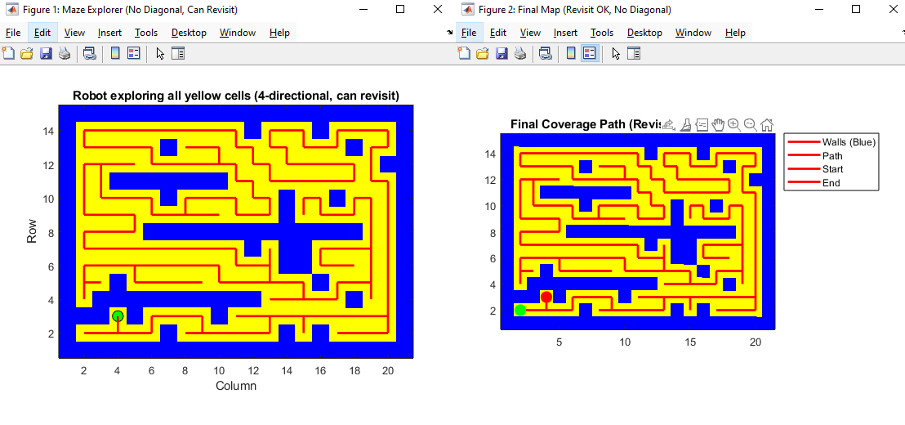
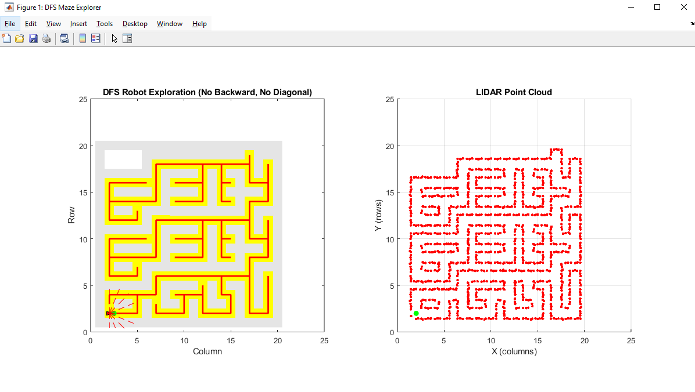
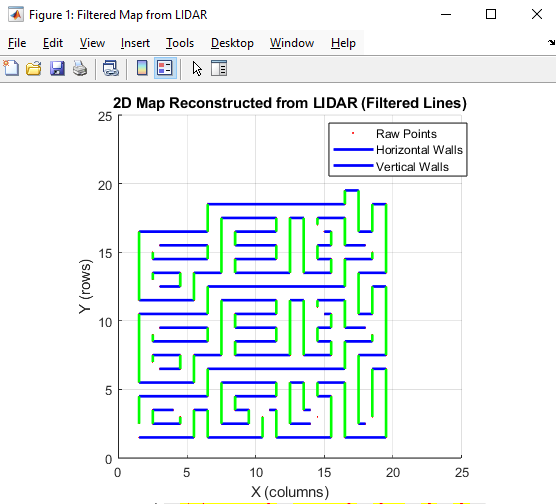

# MATLAB Robotics Simulation & Mapping Toolkit

**Author:** Le Tran Duy Tan  
**Date:** October 28, 2025  

---

## 📁 Project Structure
**📦 Robotics_Simulation**
```
┣ 📄 maze_explorer.m
┣ 📄 filter_pointlidar.m
┣ 📄 lidar_mapping_sim.m
┗ 📄 differential_drive_dynamics.m
```

Each file represents a separate robotics module focusing on exploration, mapping, and dynamics simulation.

---

### 🔹 1. maze_explorer.m — LIDAR Maze Exploration
**🧭 Description**  
Simulates a maze exploration robot equipped with a 180° LIDAR scanner using Depth-First Search (DFS).  
The robot explores a hidden maze grid, scans its environment, and builds a known map in real-time.

**⚙️ Features**
- 4-direction (up, down, left, right) motion, no diagonal movement.
- Avoids immediate 180° backtracking.
- Displays two synchronized views:
  - The robot’s exploration in the maze.
  - The LIDAR point cloud visualization.
- Stores all scanned points for post-processing.

**📊 Outputs**
- Animated maze exploration (subplot 1).
- LIDAR point cloud (subplot 2).
- Variable `lidarPoints` saved in memory for mapping reconstruction.

**🚀 Run Command**
```matlab
maze_explorer
```

---
### 🔹 2. lidar_mapping_sim.m — Combined Simulation (Exploration + Mapping)
**🧭 Description**  
Integrates both exploration and map filtering to demonstrate autonomous mapping.  
The file runs exploration, collects LIDAR data, and immediately reconstructs the map.

**📈 Output**
Displays both exploration path and reconstructed 2D environment in one workflow.


---
### 🔹 3. filter_pointlidar.m — Point Cloud Filtering & Map Reconstruction
**🧩 Description**  
Processes the LIDAR data collected from `maze_explorer.m` to reconstruct a clean 2D map of walls and corridors.  
It aligns scattered points onto a grid and merges them into straight horizontal and vertical wall segments.

**⚙️ Algorithm Steps**
1. Snap all LIDAR points to grid cells (`gridStep = 0.5`).
2. Group nearby points along rows (Y-axis) and columns (X-axis).
3. Detect and plot continuous wall segments with minimum length (`minLen = 3`).

**📊 Visualization**
- Red dots: raw LIDAR points  
- Blue lines: horizontal walls  
- Green lines: vertical walls  

**🚀 Run Command**
```matlab
filter_pointlidar
```
*(Requires `lidarPoints` variable from `maze_explorer.m`)*


---

### 🔹 4. differential_drive_dynamics.m — Dynamic Model of Robot
**⚙️ Description**  
Simulates the physical dynamics of a differential-drive robot with DC motor electrical models.  
The script includes:
- Full dynamic equations of motion (mechanical + electrical).
- Step voltage inputs to simulate forward and turning motion.
- Visualization of trajectory, speed, angular velocity, and motor currents.

**🧮 State Variables**
| Symbol | Description |
|:-------:|:------------|
| x, y | Position |
| θ | Orientation |
| v | Linear velocity |
| ω | Angular velocity |
| iR, iL | Right/Left motor currents |

**🧠 Equations Modeled**
```
m * v_dot = r * (τ_R + τ_L) - b_v * v
I_z * ω_dot = (r / b) * (τ_R - τ_L) - b_ω * ω
L * i_dot = V - R * i - K_e * ω_wheel
```

**🚀 Run Command**
```matlab
differential_drive_dynamics
```

---

## 🧠 Requirements
- MATLAB R2021a or later  
- No additional toolboxes required

---

✍️ Author
**Le Tran Duy Tan**  

