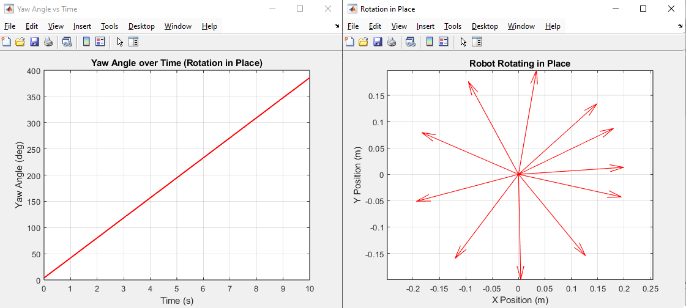

# Differential Drive Robot Simulation (MATLAB)

This repository provides several MATLAB scripts that simulate the motion of a **2-wheel differential drive robot** in 2D space using kinematic equations.  
Each script visualizes the robot's path, orientation (Yaw angle), and how its movement changes under different driving conditions.

---

## 📂 Files Overview

### `TWO_WHEEL_ROBOT_SIMULATION.m`
- Basic simulation of a differential drive robot.
- Uses wheel velocities `vL`, `vR` to compute:
  \[
  v = \frac{v_R + v_L}{2}, \quad \dot{\theta} = \frac{v_R - v_L}{L}
  \]
- Displays:
  - 2D trajectory (`X-Y Path`)
  - Yaw angle (`Heading`) over time
- Great for understanding robot kinematics.


---

### `STRAIGHT_LINE_SIMULATION.m`
- Simulates straight-line motion.
- Both wheels have equal velocity (`vL = vR`).
- The robot moves along the **X-axis**, maintaining a constant yaw angle (`θ = 0°`).
- Output:
  - Blue line showing straight path
  - Flat Yaw vs Time graph

---

### `ROTATION_IN_PLACE.m`
- Simulates **in-place rotation**.
- Wheels rotate in opposite directions (`vL = -vR`).
- The robot spins around its center without translating.
- Output:
  - Fixed position on XY plane
  - Linear increase in Yaw angle over time

---

### `ZIGZAG_PATH_SIMULATION.m`
- Simulates **zig-zag (oscillating)** motion.
- Wheel velocities vary with sine and cosine:
  ```matlab
  vL = 0.12 + 0.04*sin(0.5*t);
  vR = 0.12 + 0.04*cos(0.5*t);
  ```
- The robot moves forward while turning alternately left and right.
- Output:
  - Wave-shaped trajectory
  - Yaw angle oscillating between ± values

---

### `NAVIGATION_IN_MAZE.m`
- Simulates a robot navigating a **2D maze**.
- The maze is represented by a binary matrix (`0 = free`, `1 = wall`).
- Robot moves forward until detecting a wall, then randomly turns **90° left or right** to avoid obstacles.
- Output:
  - Maze map (gray)
  - Blue line = traveled path
  - Red circle = robot position

---

## ⚙️ How to Run
1. Open MATLAB.
2. Place all `.m` files in the same working directory.
3. Run any file, for example:
   ```matlab
   >> NAVIGATION_IN_MAZE
   ```
4. Observe:
   - A 2D plot of the robot’s trajectory.
   - A graph of yaw (heading) versus time.

---

## 🧠 Notes
- Simulations use **pure kinematics** (no friction, dynamics, or slip).
- You can modify:
  - `L` (wheel distance)
  - `dt` (time step)
  - `vL`, `vR` (wheel speeds)
  - `maze` matrix (for custom maps)
- Ideal for learning mobile robot motion and path visualization.

---

**Author:** Lê Trần Duy Tân  
**Language:** MATLAB  
**Category:** Robotics Simulation / Mobile Robot Kinematics  
**Last Updated:** 2025